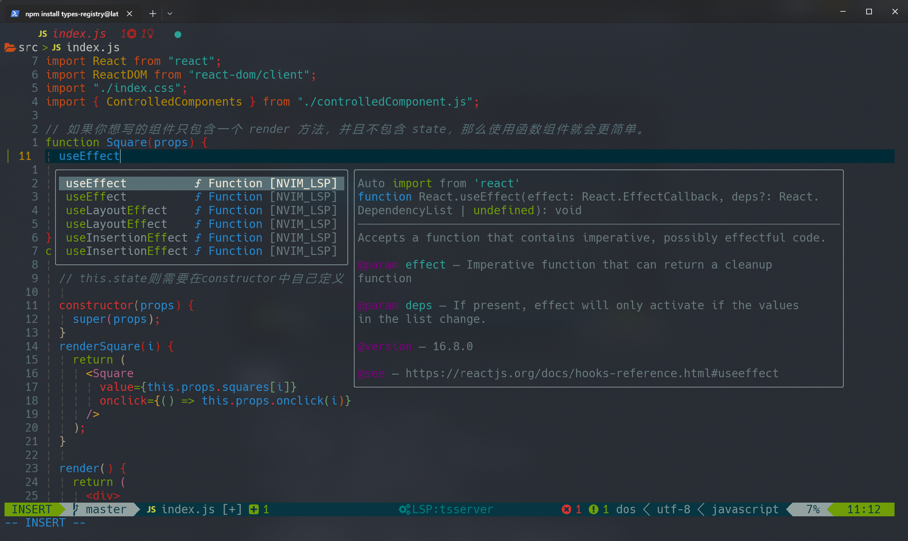

# Collect config

```
# example

mkdir bash && touch bash/.bashrc
stow -t ~ bash --adopt

mkdir -p nvim/.config
mv ~/.config/nvim nvim/.config/nvim
stow -t ~ nvim

mkdir -p pacman/etc/pacman.d
touch pacman/etc/pacman.conf
touch pacman/etc/pacman.d/mirrorlist
sudo stow -t / pacman --adopt
```

# Install

- clone the repo to `~`
- nvim config install
  - run `nvim -u {/path/to/repo}/.config/nvim/init.lua`
  - run `:TSInstall lua,vimscript,....` in nvim
  - run `:checkhealth`, install dependencies
- stow link

  ```
  # add `-n -v` option to check what will do
  stow bash ....
  sudo stow -t / pacman ...
  ```
- pacman

  ```
  # get installed package list
  pacman -Qqet > pkglist.txt
  # install from package list file
  pacman -S --needed - < pkglist.txt

  # if it contains external packages such as AUR, it needs to be filtered before execution.
  pacman -S --needed $(comm -12 <(pacman -Slq | sort) <(sort pkglist.txt))

  # remove packages not listed in the file
  pacman -Rsu $(comm -23 <(pacman -Qq | sort) <(sort pkglist.txt))
  ```

# Directory Structure

TODO

# Depenency

- neovim>=0.9
- [ripgrep](https://github.com/BurntSushi/ripgrep)
- [fzf](https://github.com/junegunn/fzf)
- [ranger](https://github.com/ranger/ranger)(mac or linux)
- [git](https://git-scm.com/)
- [fd](https://github.com/sharkdp/fd)
- lsp: can installed by `:Mason`
- treesitter parser: can installed by `:TSInstall`
  - linux/mac: gcc is required
  - win: zig or gcc is required

# Keybinding

TODO

# Reference

- [ ] [voldikss/dotfiles](https://github.com/voldikss/dotfiles/blob/dev/nvim/init.vim)
- [ ] [craftzdog/dotfiles-public](https://github.com/craftzdog/dotfiles-public)
- [ ] [bluz71/dotfiles](https://github.com/bluz71/dotfiles/blob/master/vim/lua/plugin/lsp-config.lua)
- [ ] **[NvChad/NvChad](https://github.com/NvChad/NvChad)**
- [ ] [LazyVim](https://github.com/LazyVim/LazyVim)
