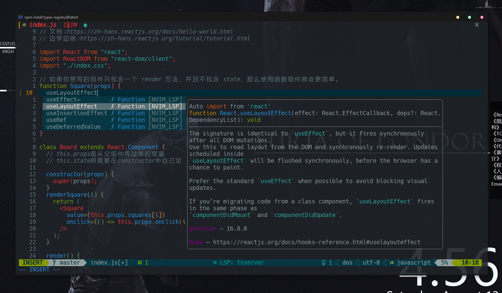
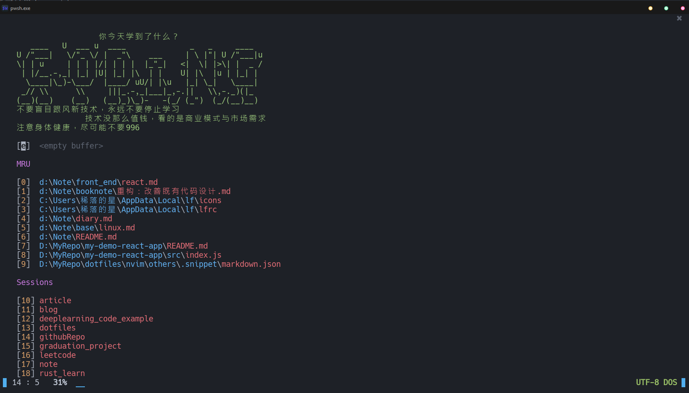
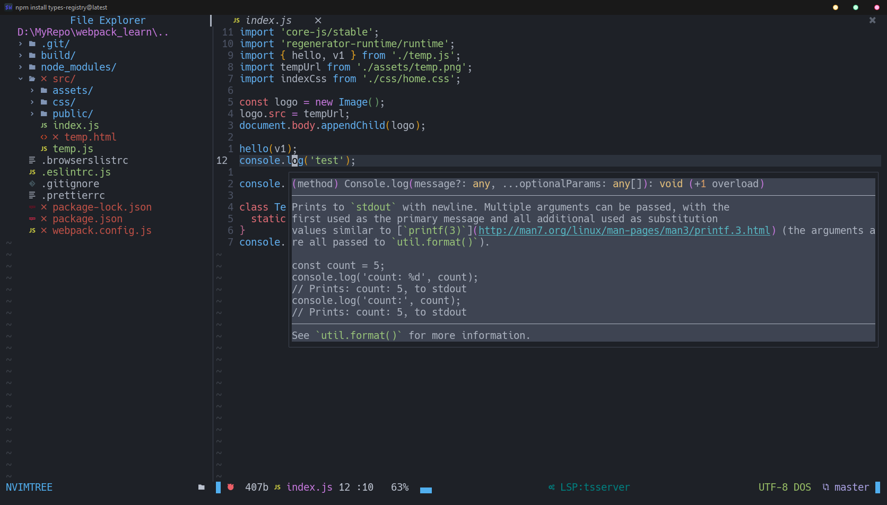
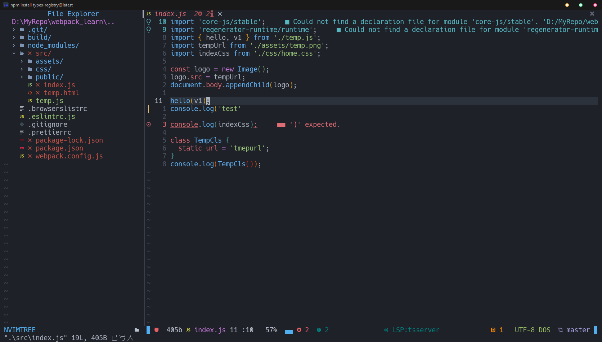
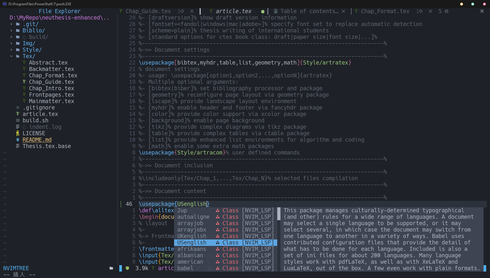
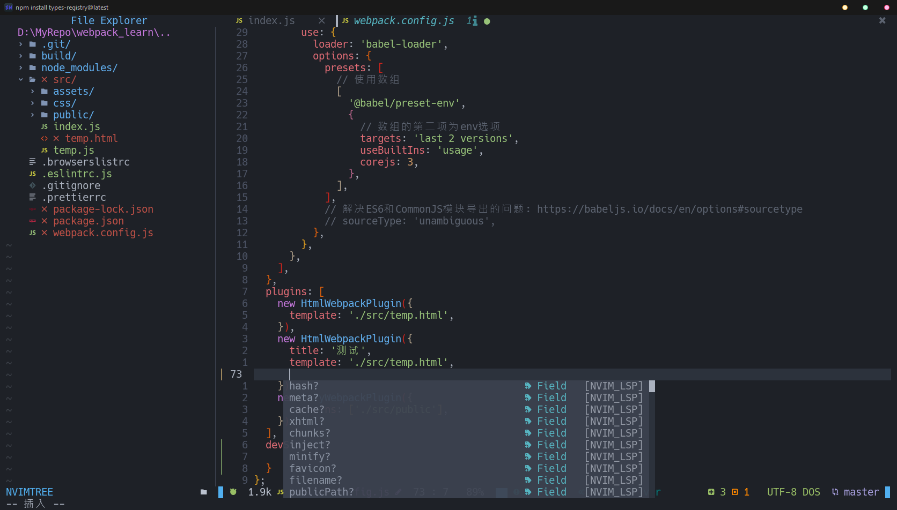
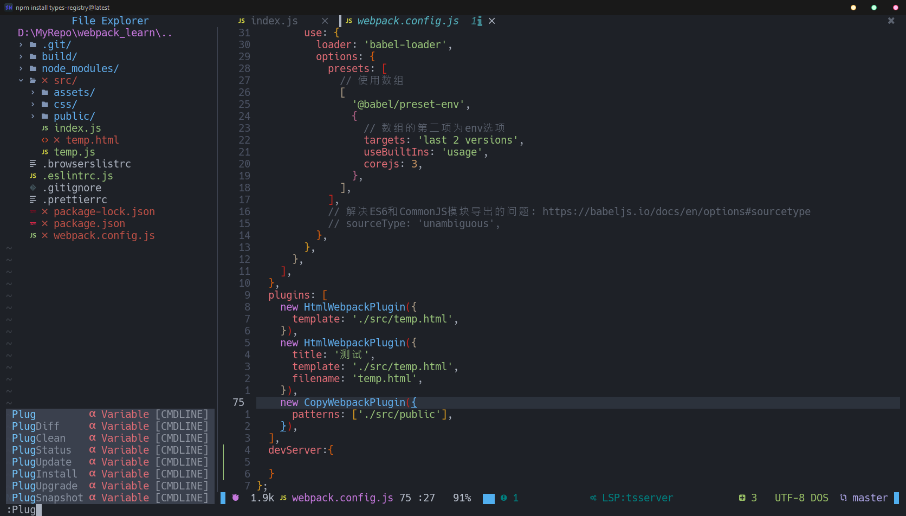
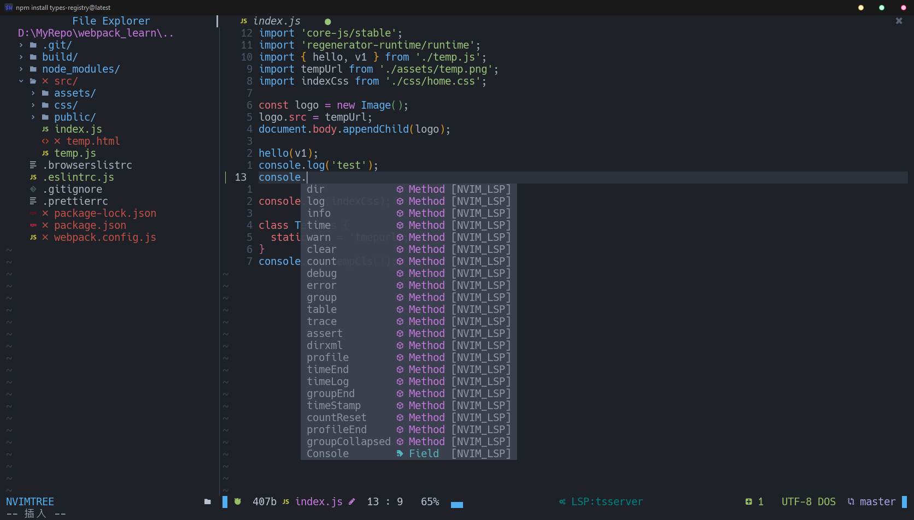
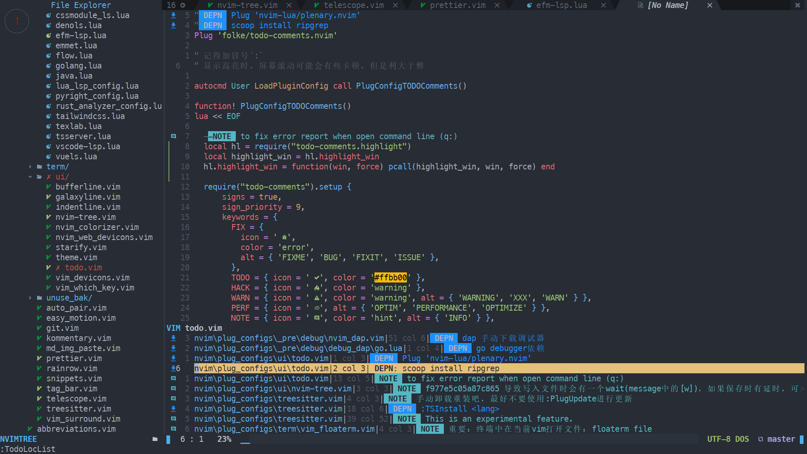

# 前言

- 尽可能只在init.vim中引入文件加载
- 插件的加载和插件的配置会放到一个文件中。
  - 唯一例外：`nvim\lua\lsp_keybing_config.lua`中会配置多个插件的keymap
- `nvim/lua`中放一些需要按需加载的文件
  - `au.lua`为手动封装的autocmd方法
  - `lsp_keybing_config.lua`为lsp所有相关的keymap
- 插件依赖的配置文件也会放到dotfiles所在目录下的`nvim/others`文件夹下
- 保证迁移方便，在默认配置文件下写`source path/to/init.vim`即可
  - 或者在启动nvim时 `nvim -u path/to/init.vim`
- 两个核心参数可以通过`--cmd 'let g:xxxx = "sss"'` 传入
  > 可参照 [powershell config](./powershell/user_profile.ps1)
  - `let g:skip_project_plugs=1` 会跳过大多数插件，适合单文件编辑
  - `let g:code_language_list=['rust']` 会为指定语言开启lsp以及自动补全

# 待做项

- [ ] **配置优化(重要)**
  - [ ] 暂不考虑纯lua配置，依旧使用LoadLua,LoadScript，便于控制加载顺序
    > windows下插件默认配置文件位置有些分散。
  - [ ] 优化为符合vim配置规范的配置目录
    - `if !exists('g:loaded_xxxxxx') | finish | endif`
    - `pcall`
  - [x] **init.vim 主题配置简化**
  - [ ] **目录调整，优化**
  - [ ] **无用注释删除，配置精简**
- [ ] 键位整理(重要)
- [x] coc换为lsp
- [x] LoadLua 函数 ,修改`package.path`
- [x] 配置结构优化
- [ ] README补充
- [x] airline换掉
- [x] react 开发环境搭建
- [x] 自动补全颜色
- [ ] 插件
  - vim-visual-multi
  > 主要是java jdtls
- [ ] ~bash自动化记录和设置插件版本~
  - `vim-plug`的`PlugSnapshot`命令暂且够用
- [ ] ~拿c写一个启动程序？~
- [ ] 把插件配置写到`after/plugin`，写一些`pcall`或者全局变量 什么的来判断是否加载？
- [ ] mklink 一些配置文件到dotfiles文件夹
- [ ] lua配置中，require替换为pcall
- [ ] **java开发环境配置**
  - 参考：[JavaHello/nvim](https://github.com/JavaHello/nvim)
  - 反编译以及跳转不太好搞，暂且老老实实用ide吧
- [ ] lf工具详细配置
- [ ] wezterm 快捷键配置调整。[参考](https://github.com/ivaquero/oxidizer.sh/blob/master/defaults/wezterm.lua)

# nvim准备尝试插件

- [ ] nvim-dap
  - 调试利器，go配置成功了，但是c++总是配置不好
  - 因不提供断点保存功能，这里有断点保存配置方案，也有已经整理好的插件[issue跳转](https://github.com/mfussenegger/nvim-dap/issues/198)
- [ ] vim-visual-multi
- [ ] asyn_run.vim
- [ ] asynctasks
- [ ] vim-table-mode
  - 格式化的话，markdown中，感觉用prettier就够用了
  - 不过这个还提供类似excel公式计算的功能
- [ ] toggletask.nvim
- [ ] symbols-outline.nvim
  - 依赖lsp的大纲插件
- [ ] mason
  - 自动化封装了好多，不是太尝试
- [ ] 全局替换插件：[nvim-spectre](https://github.com/nvim-pack/nvim-spectre)
-

# nvim键位整理

> TODO: 键位整理

# 待尝试工具

- Zellij + alacritty 替代wezterm
  - Zellij 的windows支持已提上日程。多平台支持，可以用来替换tmux

# 图片展示

- Session

   点击进入session后会还原之前编辑的文件，编辑位置，界面布局等等。

  

- lsp

  

  

  

- 自动补全

  

  

  

- 多环境支持

  

- session支持(类似vscode的工作空间)

- todo list

  

- ...(有时间再补充)

# 备忘记录

## 弃用插件

```
airline.vim           
asyn_run.vim
auto_save.vim         
beacon.vim            
coc.vim               
comfortable_motion.vim
efm-lsp.lua           
fzf.vim
galaxyline.lua        
alpha-nvim
neovim-session-manager
javascript.vim        
jsx.vim
neoscroll.vim         
nerdcommenter.vim     
nerdtree.vim
python.vim            
toggleterm.vim        
typescript.vim        
vim_css_color.vim     
vista.vim             
```

## 随笔

- icon支持
  - 针对vimscript插件:`ryanoasis/vim-devicons`
  - 针对lua插件:`kyazdani42/nvim-web-devicons`

- treesitter的更新
  - 最好手动del后再clone
  - 否则偶尔可能出bug。
  - 吃过那个的苦

- indent
  - 大多数语言插件会提供indent支持。
  - 这里默认开着treesitter的indent。需要可以到[这里](./nvim/plugs/treesitter.vim)关闭

- css classname auto complate
  - tailwindcss lsp
    - 使用tailwind开发时可以用
    - 同样可以用在react中
    - 但是需要taildwindcss依赖
    - [使用示例](https://www.youtube.com/watch?v=GznmPACXBlY&t=6227s)
  - [cssmodule_ls](https://github.com/antonk52/cssmodules-language-server): 
    - 比较通用
    - 但是windows上不太好用

- `_pre`文件夹下保存一些不太常用的功能
  - 可能会在未来重新调整一下配置

- 配置修改后使用nvimPower看一下有没有报错

# 参考配置

- [ ] [voldikss/dotfiles](https://github.com/voldikss/dotfiles/blob/dev/nvim/init.vim)
- [ ] [craftzdog/dotfiles-public](https://github.com/craftzdog/dotfiles-public)
- [ ] [bluz71/dotfiles](https://github.com/bluz71/dotfiles/blob/master/vim/lua/plugin/lsp-config.lua)
- [ ] **[NvChad/NvChad](https://github.com/NvChad/NvChad)**
- [ ] [JavaHello/nvim](https://github.com/JavaHello/nvim)
